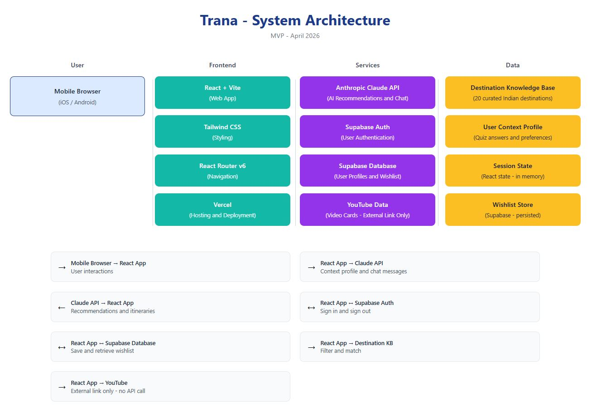

# Trana - AI Travel Discovery for Indian Travelers

> Know where you belong before you go.

Trana is an AI-native travel discovery web app built 
for Indian travelers. Instead of showing hundreds of 
options, Trana asks who you are first - your mood, 
budget, travel companions, and interests - then gives 
you a small number of destination recommendations with 
clear, personalised reasons why each one fits you.

## Live Demo

[Demo Link](https://trana-ai-travel-api-server.vercel.app/)
[Video Walkthrough](https://youtu.be/vTHCvEACVh4)

## What It Does

**Mood and Context Quiz**
A 7-question guided flow that takes under 3 minutes. Captures mood, companions, budget, duration, interests, activity level, and home city. No search box. No filters.

**AI Recommendations**
Powered by the Anthropic Claude API. Returns 3 to 5 destinations with a personalised reason for each one. Every recommendation explains why it fits your specific 
context, not just what the destination is known for.

**Chat Refinement**
Tell the AI what you actually want in plain language. Say I want to travel to Kerala or show me something quieter and it understands. Detects single destination vs multi-destination intent automatically.

**Multi-Stop Itinerary Builder**
Add 2 or more destinations, set your days and budget, and the AI builds a logical day-by-day circuit with travel time between stops, local food recommendations, 
stay options, and per-day cost estimates.

**Save and Wishlist**
Save any destination or itinerary to your wishlist. Come back to it whenever you are ready.

**Ready to Book**
When you are ready to commit, the app surfaces links to MakeMyTrip, Booking.com, and Airbnb. Trana helps you decide. Your preferred platform helps you book.

## Tech Stack

| Layer | Technology |
|---|---|
| Frontend | React 18 + Vite |
| Styling | Tailwind CSS |
| Routing | React Router v6 |
| Authentication | Supabase Auth |
| Database | Supabase |
| AI Engine | Anthropic Claude API |
| Deployment | Vercel |

## System Architecture



## Getting Started

### Prerequisites

- Node.js 18 or above
- pnpm package manager
- Supabase account
- Anthropic API key

### Installation

Clone the repository
```bash
git clone https://github.com/yourusername/trana-mvp.git
cd trana-mvp
```

Install dependencies
```bash
pnpm install
```

Set up environment variables. 
Create a .env file in the project root:
```
VITE_SUPABASE_URL=your_supabase_project_url
VITE_SUPABASE_ANON_KEY=your_supabase_anon_key
VITE_ANTHROPIC_API_KEY=your_anthropic_api_key
```

Start the development server
```bash
pnpm run dev
```

Open http://localhost:5173 in your browser.

### Supabase Setup

1. Create a new project at supabase.com
2. Go to Authentication > URL Configuration
3. Add your local URL: http://localhost:5173
4. Turn off email confirmation for development
5. Copy your Project URL and anon key to the .env file

### Deployment on Vercel

1. Push your code to GitHub
2. Connect the repository to Vercel
3. Set the root directory to artifacts/trana
4. Set build command to vite build
5. Set output directory to dist
6. Add all three environment variables in Vercel settings
7. Add your Vercel URL to Supabase allowed URLs
8. Deploy

## Project Structure
```
artifacts/trana/
  src/
    components/     Reusable UI components
    screens/        One file per screen
    data/           Mock destination data
    lib/            Supabase and Claude API clients
    context/        Auth context
    App.jsx         Routes and navigation
    main.jsx        Entry point
```

## Destination Data

The MVP includes 20 curated Indian destinations covering:

- Nature and hills: Coorg, Munnar, Meghalaya, Kasol, Ooty
- Heritage: Hampi, Mysuru, Varanasi, Jaipur, Khajuraho
- Beach and coastal: Pondicherry, Gokarna, Varkala, Andaman
- Spiritual: Rishikesh, Pushkar
- Offbeat: Spiti Valley, Ziro Valley, Chettinad, Darjeeling

Each destination includes activity level, companion types, 
budget tiers, food highlights, best travel months, and 
curated video references.

## Key Product Decisions

**Why context first?**
Most travel platforms assume intent. Most travelers do not have intent - they have a feeling, a constraint, a life situation. Capturing context before suggesting destinations is the core product insight.

**Why not build a booking flow?**
Trana owns the discovery layer - the inspiration-to-intent phase before any booking decision is made. Building a booking flow would dilute this focus and compete with platforms that have been doing it for 20 years.

**Why real Claude API and not mock data?**
Mock responses have gaps that users find quickly. The real API responds intelligently to any destination query, understands multi-destination intent, and builds accurate itineraries. For a portfolio project, this is 
the difference between a prototype and a product.

## Known Limitations

- Destination library covers 20 curated locations. Expanding to 150+ destinations is planned for V2.
- Plan Together mode for couples is planned for V2.
- Cross-session preference learning is planned for V2.
- The Anthropic API key is currently used client-side. This is acceptable for demo purposes but should be moved to a server-side API route in production.

## Product Documentation

The full Product Requirements Document covering research context, user personas, user stories, feature specifications, success metrics, and roadmap is available on request.

## Author

Built by Shijin as a 0 to 1 product management assignment demonstrating end-to-end product thinking from research and PRD through design, development, and deployment.
[LinkedIn]() | [Portfolio]()

## License

This project is for educational and portfolio purposes.
